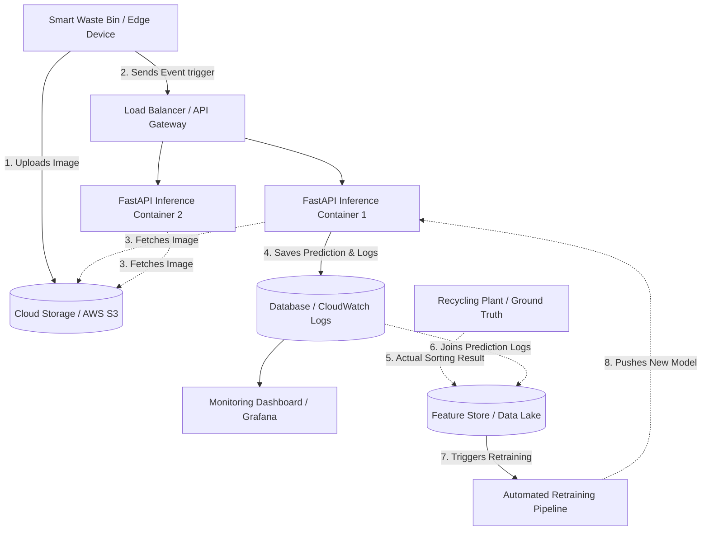

# ♻️ Waste Classification MLOps Deployment Pipeline

This repository contains a complete, production-ready MLOps deployment pipeline for a Waste Classification inference service. It is designed to demonstrate system design, containerized deployment, CI/CD, and Day-2 observability.

---

## 🏗️ 1. Architecture & Data Pipeline




### 🔄 Additional Data Pipeline: From Machines to Model
To maintain model accuracy, an initial inference pipeline is insufficient. A **Ground Truth & Retraining Pipeline** is required:
1. **Physical Validation (Ground Truth):** When the bin is emptied at the recycling plant, operators/optical sorters determine the *actual* waste material.
2. **Log Joining:** This actual result is sent back to the cloud and joined with the original API prediction logs via the `sensor_id` and timestamp.
3. **Automated Retraining:** If the system detects accuracy dropping below an acceptable threshold (Model Drift), it triggers an automated Retraining Pipeline to fine-tune the model on new data and redeploys it via CI/CD.

---

## ⚠️ 2. Production Risks & Mitigations

1. **Payload Overload:** Edge devices sending high-resolution, raw base64 images directly in the API payload will cause memory exhaustion. 
   * *Mitigation:* The edge device uploads the heavy image to an S3 bucket first, and only sends the lightweight `image_url` to the API.
2. **Data & Concept Drift:** The physical appearance of waste changes over time (e.g., new packaging designs).
   * *Mitigation:* Implementing the active Ground Truth feedback loop (mentioned above) to monitor accuracy.
3. **Traffic Spikes:** Sudden surges in disposal events can overwhelm the inference containers.
   * *Mitigation:* Deploying containers behind an Auto-Scaling Group (e.g., AWS ECS/Fargate) based on CPU/Memory utilization, or using a message queue (AWS SQS) for asynchronous processing.

---

## 📊 3. Monitoring Concept (Day-2 Operations)

Observability is built directly into the inference logic using structured logging.

* **How failed predictions are tracked:** We defined a `CONFIDENCE_THRESHOLD` (0.75). If the model's confidence drops below this score, the API generates a `WARNING` log. In production, this triggers an alert and routes the image metadata to a Dead Letter Queue (DLQ) for human review.
* **Detecting model drift or accuracy issues:** By actively joining our inference logs against "Ground Truth" data (actual physical sorting results), we calculate real accuracy. If the accuracy drops below a baseline (e.g., 85%) over a 7-day rolling window, a drift alert is fired.
* **Metrics feeding the AI Dashboard:**
    * *Infrastructure:* API Latency (ms), Requests Per Second (RPS), Error Rates (HTTP 500s).
    * *ML Intelligence:* Average Confidence Score per waste category, Daily Waste Distribution Trends, and Low-Confidence Alert frequency.

---

## 🛠️ 4. Engineering & Architectural Decisions

* **Alternatives Rejected:** * *Serverless Functions (AWS Lambda):* Rejected due to "cold start" latency, which is unacceptable for real-time mechanical sorting at the edge device. 
    * *Heavy ML Serving Frameworks (TorchServe):* Overkill for this lightweight simulation. **FastAPI** provides the perfect balance of asynchronous speed and microservice simplicity.
* **What I would improve first in production:**
    1.  **Infrastructure as Code (IaC):** Implement **Terraform** modules to provision all underlying infrastructure (VPCs, ECS clusters, Load Balancers) to ensure the environment is reproducible.
    2.  **Event-Driven Architecture:** Introduce a message broker (RabbitMQ/SQS) between the edge device and the inference API to buffer incoming requests.

---

## 🚀 5. Local Deployment & Source Code

You can run this entire architecture locally using Docker. 

### How to Run:
1. Ensure Docker and Docker Compose are installed.
2. Clone this repository and run:
   ```bash
   docker-compose up -d --build
   ```
3. Access the interactive API documentation to test inference: `http://localhost:8000/docs`

---

### 📂 Directory Structure & Code Reference
Below is the complete source code utilized in this repository for the deployment.

#### 1. `app/main.py` (Inference Service with Monitoring)
```python
from fastapi import FastAPI, Request
from pydantic import BaseModel
import random
import time
import logging

# Setup structured logging for monitoring dashboards
logging.basicConfig(level=logging.INFO, format='%(asctime)s - %(name)s - %(levelname)s - %(message)s')
logger = logging.getLogger("WasteMLOps-Monitor")

app = FastAPI(title="Waste Classification API", version="1.1.0")

class InferenceRequest(BaseModel):
    image_url: str
    sensor_id: str

class InferenceResponse(BaseModel):
    prediction: str
    confidence_score: float
    processing_time_ms: int

WASTE_CATEGORIES = ["Plastic", "Paper", "Glass", "Metal", "Organic"]
CONFIDENCE_THRESHOLD = 0.75

@app.post("/predict", response_model=InferenceResponse)
async def predict_waste(request: InferenceRequest, req: Request):
    start_time = time.time()
    
    # Simulate inference processing
    time.sleep(random.uniform(0.1, 0.4))
    prediction = random.choice(WASTE_CATEGORIES)
    confidence = round(random.uniform(0.60, 0.99), 2)
    processing_time = int((time.time() - start_time) * 1000)
    
    # Monitoring: Track failed/low-confidence predictions
    if confidence < CONFIDENCE_THRESHOLD:
        logger.warning(
            f"LOW_CONFIDENCE_ALERT | Sensor: {request.sensor_id} | "
            f"Prediction: {prediction} ({confidence}) | Image: {request.image_url}"
        )
    
    # Monitoring: General metrics
    logger.info(
        f"METRIC_LOG | Endpoint: /predict | Method: POST | "
        f"Latency: {processing_time}ms | Result: {prediction} | Score: {confidence}"
    )
    
    return InferenceResponse(
        prediction=prediction,
        confidence_score=confidence,
        processing_time_ms=processing_time
    )

@app.get("/health")
async def health_check():
    return {"status": "healthy", "version": "1.1.0"}
```

#### 2. `app/requirements.txt`
```text
fastapi==0.103.1
uvicorn==0.23.2
pydantic==2.3.0
```

#### 3. `Dockerfile`
```dockerfile
FROM python:3.9-slim

WORKDIR /code

COPY ./app/requirements.txt /code/requirements.txt
RUN pip install --no-cache-dir --upgrade -r /code/requirements.txt

COPY ./app /code/app

EXPOSE 8000

CMD ["uvicorn", "app.main:app", "--host", "0.0.0.0", "--port", "8000"]
```

#### 4. `docker-compose.yml`
```yaml
version: '3.8'
services:
  inference-api:
    build: .
    container_name: waste_inference_api
    ports:
      - "8000:8000"
    restart: always
    healthcheck:
      test: ["CMD", "curl", "-f", "http://localhost:8000/health"]
      interval: 30s
      timeout: 10s
      retries: 3
```

#### 5. `.github/workflows/ci-cd.yml` (CI/CD Pipeline)
```yaml
name: MLOps Deployment Pipeline

on:
  push:
    branches: [ "main" ]

jobs:
  build-and-simulate-deploy:
    runs-on: ubuntu-latest
    steps:
    - name: Checkout Code
      uses: actions/checkout@v3

    - name: Set up Docker Buildx
      uses: docker/setup-buildx-action@v2

    - name: Build Docker Image
      run: |
        docker build -t waste-inference-api:${{ github.sha }} .
        docker tag waste-inference-api:${{ github.sha }} waste-inference-api:latest

    - name: Simulate Deployment & Rollback Strategy
      run: |
        echo "✅ Image successfully built with tag: ${{ github.sha }}"
        echo "🚀 Simulating push to AWS ECR..."
        echo "🔄 Simulating deployment to orchestration service..."
        echo "🛡️ Rollback Plan: If health check fails, auto-revert to previous Git SHA tag."
```


Watch The Demo ---->> https://drive.google.com/file/d/190GZDHyK6b2_jCf41SCj8jo_MzgpxntQ/view?usp=drive_link
